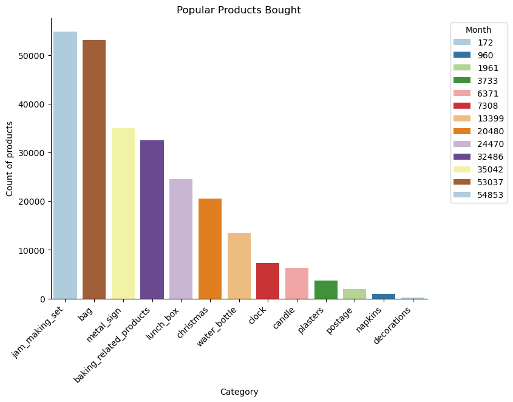

# Introduction
The Dataset I used is called Customer segmentation that belongs to [M Yasser H](/https://www.kaggle.com/datasets/yasserh/customer-segmentation-dataset/). It contains purchase history of over 2400 customers and has over 541,000 rows of data.

Here are the SQL queires I used to generate my various insights:
[Customer_Segmentation](sql_code)

# Background
I sought a dataset that would enable me to conduct customer segmentation using SQL and uncover valuable metrics for business performance, operations, and customer behavior, particularly regarding purchasing patterns. The identified metrics could also be used to refine or enhance existing marketing strategies. 

### Problem statements I decided to use to answer my SQL queries
1. What are the major customer segments for the store?
2. Which customers are at risk of churning?
3. Who are the store's top customers in terms of Customer lifetime value?
4. What's the average time per purchase for customers and which ones out of the top purchasers have the highest average time to purchase?
5. What are some of the more popular products bought from the store(considering the lack of product categories from the dataset)?

# Tools I used
The tools I used to generate my insights for the project include the following:
- **SQL**
- **Python**
- **PostgreSQL :** My ideal database management that is linked to my code editor.
- **Visual Studio Code**: My ideal code editor for SQL queries
- **Git and GitHub:** Needed a version control to showcase the steps and changes  made as I progressed with my analysis. It's also ideal for sharing and collaboration purposes.

# The Analysis

### 1. What are the major customer segments for the store?

```SQL
-- Frequent Buyers
SELECT
    SUM(quantity) AS total_quantity,
    ROUND(SUM(CAST(quantity*unitprice AS numeric)),2) AS Total_spent,
    customerid
FROM
    online_retail
WHERE
    customerid IS NOT NULL
GROUP BY
    customerid
ORDER BY
    total_quantity DESC
LIMIT
    30 

--Periodic Purchasers by month

WITH ranked_monthlypurchases AS(
    SELECT
        SUM(quantity) AS total_quantity,
        ROUND(SUM(CAST(quantity*unitprice AS numeric)),2) AS Total_spent,
        EXTRACT(MONTH FROM invoicedate) AS date_month,
        TO_CHAR(invoicedate, 'Month') AS month_name,
        customerid,
        ROW_NUMBER () OVER (PARTITION BY EXTRACT(MONTH FROM invoicedate) ORDER BY SUM(quantity) DESC) AS rank
    FROM
        online_retail
    WHERE
        invoicedate IS NOT NULL
        AND customerid IS NOT NULL
    GROUP BY
        customerid,
        date_month,
        month_name
    ORDER BY
        total_spent DESC
)
SELECT
    *
FROM
    ranked_monthlypurchases
WHERE
    rank = 1
ORDER BY
    total_spent DESC

```

#### **Insights I gained from the problem statement:**
| total_quantity | total_spent | date_month | month_name | customerid | rank |
|----------------|-------------|------------|------------|------------|------|
| 25662          | 70246.50     | 9          | September  | 17450      | 1    |
| 26742          | 39995.95     | 10         | October    | 14646      | 1    |
| 29107          | 39655.81     | 8          | August     | 14646      | 1    |
| 19577          | 28408.14     | 5          | May        | 14646      | 1    |
| 20300          | 26476.68     | 1          | January    | 14646      | 1    |
| 11665          | 26464.99     | 7          | July       | 14156      | 1    |
| 18320          | 25375.41     | 11         | November   | 14646      | 1    |
| 18663          | 25288.99     | 6          | June       | 14646      | 1    |
| 16271          | 22752.46     | 2          | February   | 14646      | 1    |
| 14125          | 21462.40     | 3          | March      | 14646      | 1    |
| 14672          | 20319.90     | 12         | December   | 14646      | 1    |
| 13662          | 9656.85      | 4          | April      | 14298      | 1    |


The code initially identifies the top 30 customers based on total spending. Subsequently, it highlights the top customers per month. This information can be leveraged for targeted marketing initiatives, such as sending seasonal promotions to monthly top purchasers and tailored offers to the top 30 annual spenders, to stimulate increased customer purchases.

### 2. Which customers are at risk of churning?
Next, I wanted to identify which customers, out of the top 30 purchasers, are at risk of churning so I filtered the data and compiled a table showcasing the month-by-month total spent for each customer and then plot the results. I used the final 3 months of the fiscal year to identify a declining trend.

```SQL
WITH TOP_PURCHASES AS(
    SELECT
        SUM(quantity) AS total_quantity,
        ROUND(SUM(CAST(quantity*unitprice AS numeric)),2) AS Total_spent,
        customerid AS top_customerid
    FROM
        online_retail
    WHERE
        customerid IS NOT NULL
    GROUP BY
        customerid
    ORDER BY
        total_spent DESC
    LIMIT
        30
 
)
SELECT 
    TP.top_customerid,
    ROUND(SUM(CAST(CASE WHEN EXTRACT(MONTH FROM ORT.invoicedate) = 1 THEN ORT.quantity * ORT.unitprice ELSE 0 END AS numeric)), 2) AS total_spent_january,
    ROUND(SUM(CAST(CASE WHEN EXTRACT(MONTH FROM ORT.invoicedate) = 2 THEN ORT.quantity * ORT.unitprice ELSE 0 END AS numeric)), 2) AS total_spent_february,
    ROUND(SUM(CAST(CASE WHEN EXTRACT(MONTH FROM ORT.invoicedate) = 3 THEN ORT.quantity * ORT.unitprice ELSE 0 END AS numeric)), 2) AS total_spent_march,
    ROUND(SUM(CAST(CASE WHEN EXTRACT(MONTH FROM ORT.invoicedate) = 4 THEN ORT.quantity * ORT.unitprice ELSE 0 END AS numeric)), 2) AS total_spent_april,
    ROUND(SUM(CAST(CASE WHEN EXTRACT(MONTH FROM ORT.invoicedate) = 5 THEN ORT.quantity * ORT.unitprice ELSE 0 END AS numeric)), 2) AS total_spent_may,
    ROUND(SUM(CAST(CASE WHEN EXTRACT(MONTH FROM ORT.invoicedate) = 6 THEN ORT.quantity * ORT.unitprice ELSE 0 END AS numeric)), 2) AS total_spent_june,
    ROUND(SUM(CAST(CASE WHEN EXTRACT(MONTH FROM ORT.invoicedate) = 7 THEN ORT.quantity * ORT.unitprice ELSE 0 END AS numeric)), 2) AS total_spent_july,
    ROUND(SUM(CAST(CASE WHEN EXTRACT(MONTH FROM ORT.invoicedate) = 8 THEN ORT.quantity * ORT.unitprice ELSE 0 END AS numeric)), 2) AS total_spent_august,
    ROUND(SUM(CAST(CASE WHEN EXTRACT(MONTH FROM ORT.invoicedate) = 9 THEN ORT.quantity * ORT.unitprice ELSE 0 END AS numeric)), 2) AS total_spent_september,
    ROUND(SUM(CAST(CASE WHEN EXTRACT(MONTH FROM ORT.invoicedate) = 10 THEN ORT.quantity * ORT.unitprice ELSE 0 END AS numeric)), 2) AS total_spent_october,
    ROUND(SUM(CAST(CASE WHEN EXTRACT(MONTH FROM ORT.invoicedate) = 11 THEN ORT.quantity * ORT.unitprice ELSE 0 END AS numeric)), 2) AS total_spent_november,
    ROUND(SUM(CAST(CASE WHEN EXTRACT(MONTH FROM ORT.invoicedate) = 12 THEN ORT.quantity * ORT.unitprice ELSE 0 END AS numeric)), 2) AS total_spent_december,
    ROUND(SUM(CAST(ORT.quantity * ORT.unitprice AS numeric)), 2) AS overall_total_spent
FROM
    TOP_PURCHASES AS TP
JOIN
    Online_Retail AS ORT
    ON TP.top_customerid = ORT.customerid
GROUP BY
    TP.top_customerid
ORDER BY
    overall_total_spent DESC
```

#### **Insights I gained from the problem statement:**


*Bar graph showcasing the final three-month trend of total spent by customers*

The plot indicates that customer IDs 12415, 14646, and 16684 are particularly valuable. The business could implement targeted digital marketing campaigns and offer personalized promotions and discounts, such as bulk order discounts, at the beginning of the next fiscal year to maximize engagement with these customers.

### 3. Who are the store's most valuable customers in terms of Customer lifetime value?

```SQL
-- Average Purchase Value
WITH avg_purchase_value AS (
    SELECT
        customerid,
        SUM(quantity * unitprice) / COUNT(DISTINCT invoiceno) AS average_purchase_value
    FROM
        online_retail
    GROUP BY
        customerid
),

-- Purchase Frequency
purchase_frequency AS (
    SELECT
        customerid,
        COUNT(DISTINCT invoiceno) / COUNT(DISTINCT EXTRACT(YEAR FROM invoicedate)) AS purchase_frequency
    FROM
        online_retail
    GROUP BY
        customerid
),

-- Average Customer Lifespan
average_customer_lifespan AS (
    SELECT
        customerid,
        EXTRACT(YEAR FROM AGE(MAX(invoicedate), MIN(invoicedate))) AS customer_lifespan_years
    FROM
        online_retail
    GROUP BY
        customerid
),

-- Customer Value
customer_value AS (
    SELECT
        apv.customerid,
        ROUND(CAST(apv.average_purchase_value * pf.purchase_frequency AS numeric), 2) AS customer_value
    FROM
        avg_purchase_value AS apv
    JOIN
        purchase_frequency AS pf 
        ON apv.customerid = pf.customerid
),

-- Customer Lifetime Value
customer_lifetime_value AS (
    SELECT
        cv.customerid,
        ROUND(cv.customer_value * acl.customer_lifespan_years, 2) AS customer_lifetime_value
    FROM
        customer_value AS cv
    JOIN
        average_customer_lifespan AS acl 
        ON cv.customerid = acl.customerid
)

-- Final Selection
SELECT
    *
FROM
    customer_lifetime_value
ORDER BY
    customer_lifetime_value DESC;

```

#### **Insights I gained from the problem statement:**
- The code identified the top 30 customers based on customer lifetime value (CLV). This data can be valuable for the business when introducing new products, as it provides a targeted audience for advertising and product positioning.
- The store can leverage these high-value customers to gather valuable feedback on products, services, and potential business model improvements. This feedback can inform future product development and service enhancements.

### 4. What's the average time per purchase for customers and out of the top purchasers,who have the highest average time to purchase?

```SQL
WITH purchase_times AS (
    SELECT
        CustomerID,
        InvoiceDate,
        LAG(InvoiceDate) OVER (PARTITION BY CustomerID ORDER BY InvoiceDate) AS previous_purchase_time
    FROM
        online_retail
),

time_diffs AS (
    SELECT
        CustomerID,
        EXTRACT(EPOCH FROM (InvoiceDate - previous_purchase_time))/86400 AS days_between_purchases
    FROM
        purchase_times
    WHERE
        previous_purchase_time IS NOT NULL
)

SELECT
    CustomerID,
    ROUND(AVG(days_between_purchases), 2) AS avg_days_between_purchases
FROM
    time_diffs
GROUP BY
    CustomerID
ORDER BY
    avg_days_between_purchases DESC;

--Matching customers

WITH avg_days AS (

    WITH purchase_times AS (
        SELECT
            CustomerID,
            InvoiceDate,
            LAG(InvoiceDate) OVER (PARTITION BY CustomerID ORDER BY InvoiceDate) AS previous_purchase_time
        FROM
            online_retail
    ),
    time_diffs AS (
        SELECT
            CustomerID,
            EXTRACT(EPOCH FROM (InvoiceDate - previous_purchase_time))/86400 AS days_between_purchases
        FROM
            purchase_times
        WHERE
            previous_purchase_time IS NOT NULL
    )
    SELECT
        CustomerID,
        ROUND(AVG(days_between_purchases), 2) AS avg_days_between_purchases
    FROM
        time_diffs
    GROUP BY
        CustomerID
),

top_customers AS (

    SELECT
        SUM(quantity) AS total_quantity,
        ROUND(SUM(CAST(quantity * unitprice AS numeric)), 2) AS Total_spent,
        customerid AS top_customerid
    FROM
        online_retail
    WHERE
        customerid IS NOT NULL
    GROUP BY
        customerid
    ORDER BY
        total_spent DESC
    LIMIT
        30
)

SELECT
    tc.top_customerid AS CustomerID,
    tc.Total_spent,
    ad.avg_days_between_purchases
FROM
    top_customers AS tc
JOIN
    avg_days AS ad
    ON tc.top_customerid = ad.CustomerID
ORDER BY
    ad.avg_days_between_purchases DESC;
```

#### **Insights I gained from the problem statement:**
- The code initially identifies customers with the longest average purchase intervals. Subsequently, it highlights the top 30 customers based on purchase frequency. This data can be crucial for refining marketing strategies, particularly regarding promotions and identifying potential bottlenecks in the customer journey.
- The business could offer promotions focused on logistics solutions to address potential issues like high shipping and delivery costs.

### 5. What are some of the more popular products bought from the store(considering the lack of product categories from the dataset)?

The code I used to generate the products from the descriptions column:

[Popular_Products](sql_code/PopularProducts.ipynb)

#### **Insights I gained from the problem statement:**
- Ignoring the 'other' category which includes a majority of products that I wasn't be able to categorize, some of the more popular products based on the descriptions column of the data include the following:


*Bar graph showcasing some of the more popular products offered by the business*

- The business could implement marketing strategies focused on maximizing sales and purchases of popular items across the product line. This could involve a series of digital marketing campaigns, a website redesign prioritizing these products on designated landing pages, and other targeted initiatives.

# Conclusions
- Identifying trends, both positive and negative, is essential. For instance, analyzing customer churn can help businesses pinpoint high-value customers who may require additional attention, particularly if historical data indicates consistent top purchases. This proactive approach can mitigate the risk of future customer churn.


# What I learned
- I furthered my Python and SQL skills, learning a new approach to using regular expressions for keyword identification in descriptions and expanding my knowledge of SQL window functions.